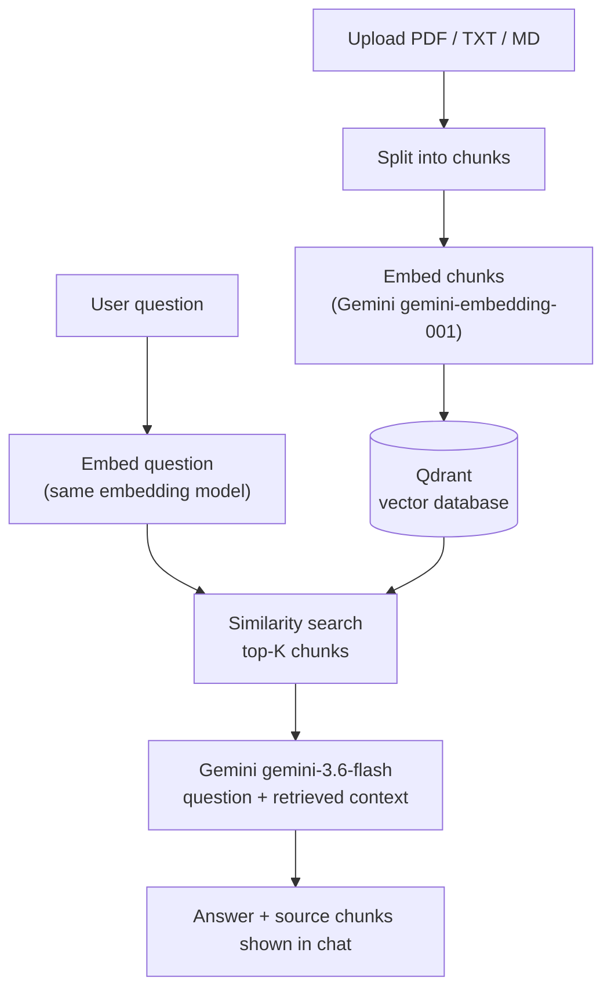

# RAG Chatbot Personal


A document Q&A chatbot built on **Retrieval-Augmented Generation (RAG)**: upload a PDF/TXT/MD document, ask questions in natural language, and get answers grounded in the document's actual content — every answer is backed by the exact source chunks it came from.

Runs as a proper client-server stack (a Streamlit app talking to a standalone Qdrant vector database), not a single-process toy demo — the whole thing ships as one `docker compose up`.

## Why this exists

Most RAG tutorials stop at "embed some text, query a local vector store." This project goes one step further: it's packaged the way a real small service would be — containerized, with the vector database running as its own service, config via environment variables, and a clean separation between the ingestion pipeline and the chat interface.

## How it works



The app and the vector database run as **separate Docker containers** communicating over a Compose network — swap either one out independently (e.g. point at Qdrant Cloud, or a different LLM provider) without touching the other.

## Features

- 📄 Upload PDF, TXT, or Markdown documents from the browser
- 💬 ChatGPT-style chat interface (Streamlit `st.chat_message`)
- 🔍 Every answer shows the exact source chunks it was grounded in — no black-box answers
- 🐳 One-command startup via Docker Compose (app + vector DB)
- 🔄 Swappable components by design: vector DB, embedding model, and LLM are each isolated behind a small interface

## Stack

| Layer | Choice |
|---|---|
| Orchestration | [LangChain](https://www.langchain.com/) |
| LLM (generation) | Google Gemini `gemini-3.6-flash` |
| Embeddings | Google Gemini `gemini-embedding-001` (3072-dim) |
| Vector database | [Qdrant](https://qdrant.tech/) (containerized, client-server) |
| Interface | Streamlit chat UI |
| Containerization | Docker Compose (`app` + `qdrant` services) |

## Quick start

**Requirements:** Docker Desktop, a Gemini API key.

> Create your key at [Google AI Studio](https://aistudio.google.com/apikey) in a project **without** a billing account attached — this keeps you on the genuinely free tier and avoids the (separate, prepay-only) billing wallet.

```bash
git clone https://github.com/tama28967/rag-chatbot-personal.git
cd rag-chatbot-personal
cp .env.example .env
# edit .env and set GOOGLE_API_KEY

docker compose up -d --build
```

Open **http://localhost:8501**, upload a document in the sidebar, click **Proses Dokumen**, then ask it anything.

## Project structure

```
.
├── app.py               # Streamlit chat UI — upload, ingest trigger, chat loop
├── ingest.py             # Document loading → chunking → embedding → Qdrant indexing
├── Dockerfile
├── docker-compose.yml    # app + qdrant services
├── requirements.txt
└── requirements.md       # Design notes and decision log
```

## Engineering notes

A few decisions worth calling out, documented in full in [`requirements.md`](./requirements.md):

- **Chroma → Qdrant:** the original design used an embedded Chroma vector store. Its native binary reproducibly segfaulted on Windows (confirmed across multiple versions, a clean virtual environment, and two different shells) — a genuine platform incompatibility, not a config issue. Switched to Qdrant running as its own container, which also happens to be the more production-realistic choice.
- **Free-tier vs. billing-linked API keys:** a Gemini API key from a Google Cloud project with a billing account attached can return `429` even with general trial credit available, because the Gemini API's own prepay wallet is a separate balance. Keys created in a project with *no* billing account attached stay on the standard free tier.
- **Dependency discipline:** dropped the `unstructured` package (originally used for Markdown parsing) after noticing it pulled in an unrelated spaCy/NLP dependency chain that roughly tripled Docker build time for a feature a plain text loader already covers.

## Roadmap

- [ ] Live deployment (Railway/Render) for a shareable demo link
- [ ] Automated re-ingestion when files change (currently a manual button)
- [ ] Persistent chat history across container restarts

## License

MIT — see [LICENSE](./LICENSE).
